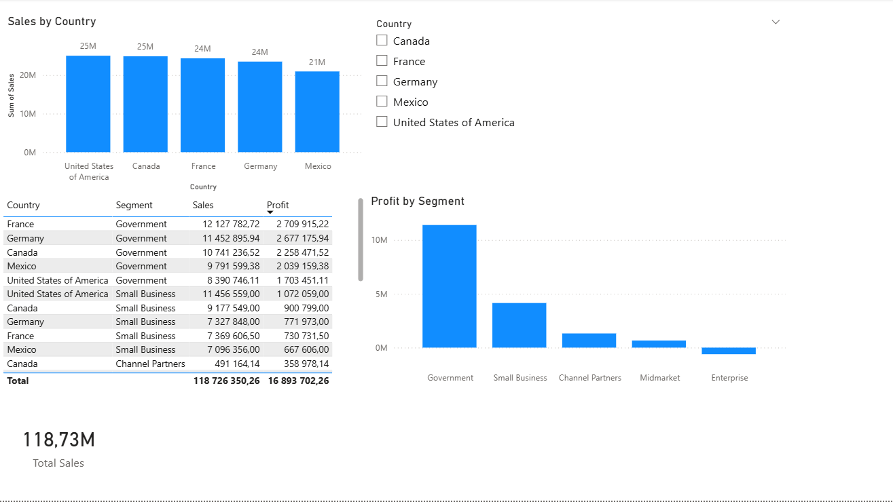

# Data Analytics Projects

This repository contains practice projects focused on developing data analysis skills using SQL and Power BI.

## Tools
- SQL (JOIN, GROUP BY, CTE)
- Power BI (Power Query, DAX, dashboards)

## Projects

### SQL Sales Analysis
Example SQL analysis using JOINs, aggregations and CTEs to analyze customer sales performance.

### Power BI Sales Dashboard
Interactive dashboard analyzing sales performance across countries and customer segments.

## Dashboard Preview

Dashboard file:
power-bi/sales_dashboard.pbix

SQL query:
sql/sales_cte_analysis.sql
